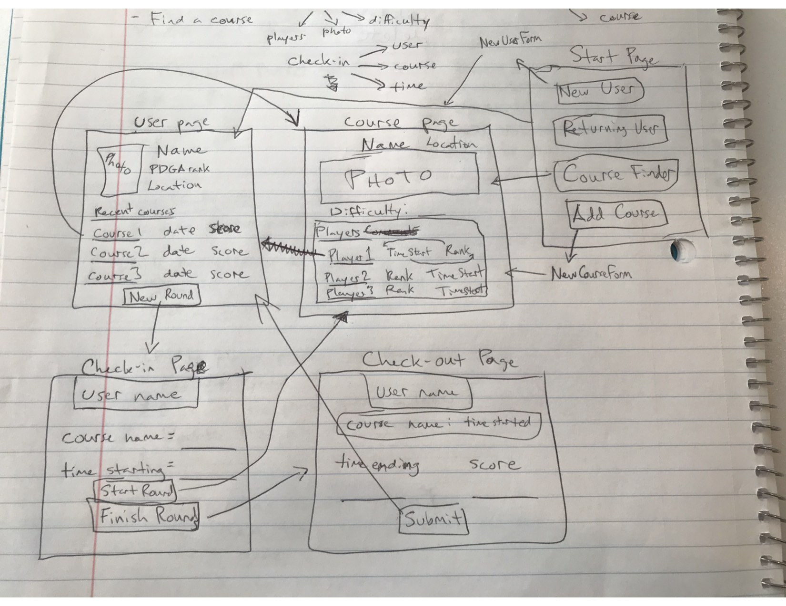
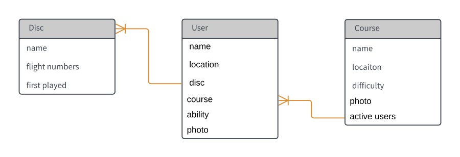

# Project 2

## About

I made a disc golf friend finder app called "DiscHeads". Using this app, players will be able to check in and out of courses, as well as view other players currectly checked in at any course. They will also be able to add, edit, and delete players, as well as courses, and discs.

## Getting Started

Heroku app location: https://disc-heads.herokuapp.com/

Trello Project Board: https://trello.com/b/NOtQHlN5/ga-project-2-disc-golf-app

### Wireframe

### ERD

## Versioning

Version 1.0

## Authors

* **Brandt Campbell** - *Initial work* - [Reboot82](https://github.com/Reboot82)

## Acknowledgments

Big shout-outs to the people that made it happen:
* Brandon Moody
* John Jacobs
* everyone else that helped me when I got stuck
